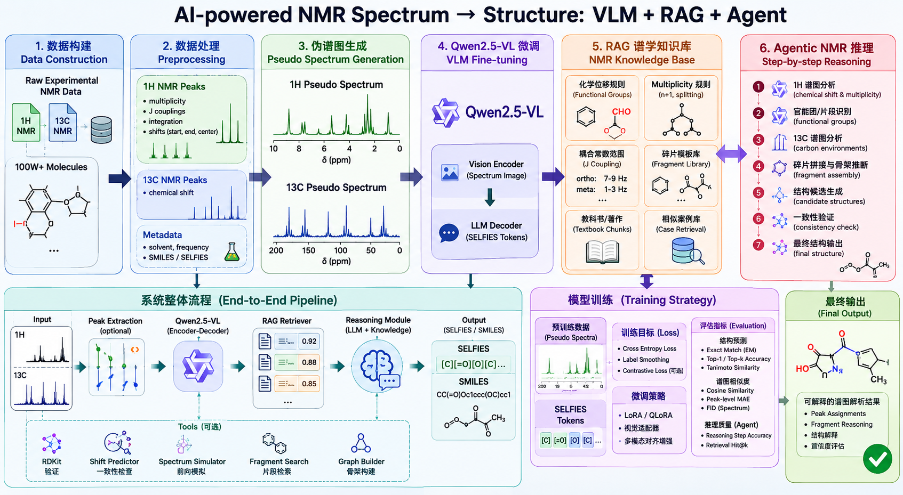

# SpectraLM：基于多模态大模型与谱学推理的 NMR 分子结构解析系统



## Quick Start

```bash
conda activate ml
pip install -r requirements.txt
python -m compileall src tests
pytest
```

Core command entrypoints:

```bash
spectralm-preprocess --config configs/preprocess.yaml
spectralm-fingerprint --config configs/fingerprint.yaml
spectralm-butina-sample --config configs/sample.yaml
spectralm-plot-selection --config configs/visualize_selection.yaml
spectralm-train --config configs/train_pilot.yaml
spectralm-evaluate --config configs/eval_pilot.yaml
spectralm-render-demo --output-dir img/
```


## 一、项目背景

核磁共振波谱（Nuclear Magnetic Resonance, NMR）是有机化学中最重要的结构解析工具之一，广泛应用于天然产物解析、药物研发、材料化学与有机合成等领域。

传统 NMR 结构解析主要依赖化学家的经验，包括：

- 化学位移分析
- 裂分规律判断
- 耦合常数分析
- 官能团推断
- 分子片段组装
- 结构一致性验证

该过程具有以下问题：

1. 依赖专家经验
2. 解析效率低
3. 难以规模化自动处理
4. 复杂谱图解析困难
5. 现有 AI 模型缺乏可解释推理能力

近年来，多模态大模型（Vision-Language Models, VLM）在图像理解、科学文献解析与复杂推理任务中展现出强大能力，为自动化 NMR 结构解析提供了新的技术路线。

然而，目前多数工作仍存在以下局限：

- 仅进行黑盒式 Spectrum → Structure 映射
- 缺乏真实谱学知识推理
- 不具备逐步解析能力
- 缺乏可解释性
- 缺少大规模实验 NMR 数据训练

因此，本项目拟构建：

# 一个融合实验 NMR 数据、多模态大模型、谱学知识库与结构推理能力的智能 NMR 解析系统。

---

# 二、项目目标

本项目的总体目标为：

# 构建一个能够基于 1H/13C NMR 谱图自动解析有机分子结构，并具备谱学推理能力的多模态 AI 系统。

系统不仅能够预测分子结构，还能够：

- 自动分析谱图特征
- 推断官能团
- 分析裂分规律
- 推断分子片段
- 逐步完成结构组装
- 提供可解释解析过程

---

# 三、核心研究内容

## 3.1 大规模实验 NMR 数据构建

### 数据来源

项目基于约 100 万条实验 NMR 数据进行训练。

数据包括：

- SMILES
- SELFIES
- 1H NMR
- 13C NMR
- 溶剂信息
- 仪器频率
- 多重峰信息
- 耦合常数
- 积分信息

---

## 3.2 离散 NMR 数据标准化

由于实验数据存在大量噪声与格式不统一问题，需要建立统一的数据清洗与标准化流程。

### 主要工作包括

#### 1. multiplicity normalization

例如：

- app d → d
- br s → brs
- aa'bb' → m

#### 2. coupling normalization

统一解析：

- 8.2Hz
- ['8.2Hz']
- [8.2]

转换为：

```python
[8.2]
```

#### 3. chemical shift normalization

统一：

- 单值位移
- 区间位移
- 浮点格式

#### 4. solvent normalization

例如：

- CDCl3
- CDCL3
- Chloroform-d

统一为标准格式。

---

# 四、伪 NMR 波谱生成

## 4.1 研究目标

将离散峰数据恢复为连续伪 NMR 波谱，用于训练多模态视觉模型。

---

## 4.2 波谱生成方法

采用 Lorentzian Line Shape 对每个峰进行展宽模拟。

连续谱函数：

\[
S(x)=\sum_i I_i \cdot \frac{1}{1+\left(\frac{x-\delta_i}{\gamma_i}\right)^2}
\]

其中：

- \(\delta_i\)：化学位移
- \(I_i\)：峰强度
- \(\gamma_i\)：峰宽参数

---

## 4.3 裂分模拟

基于 multiplicity 与 J-coupling 生成子峰结构。

支持：

- s
- d
- t
- q
- dd
- ddd
- dt
- td

等多种裂分形式。

---

## 4.4 谱图增强

为了提升模型泛化能力，引入：

### 1. baseline noise

### 2. peak broadening

### 3. baseline drift

### 4. SNR variation

### 5. peak overlap simulation

---

# 五、多模态大模型微调

## 5.1 基础模型选择

项目计划采用：

### Qwen2.5-VL-7B

作为主要 baseline。

同时对比：

- InternVL2
- DeepSeek-VL
- LLaVA
- MiniCPM-V

---

## 5.2 输入形式

模型输入包括：

### 图像输入

- 1H NMR spectrum
- 13C NMR spectrum
- Combined spectrum image

### 文本输入

- peak table
- multiplicity
- integration
- coupling constants

---

## 5.3 输出形式

模型输出：

- SMILES
- SELFIES
- canonical SMILES

---

## 5.4 微调方式

采用：

### QLoRA

进行高效参数微调。

### 训练配置

| 参数 | 配置 |
|---|---|
| Model | Qwen2.5-VL-7B |
| Precision | BF16 |
| Finetuning | QLoRA |
| Max Length | 2048 |
| Image Size | 448 |
| Batch Size | 4 |
| Learning Rate | 2e-5 |

---

# 六、谱学知识增强系统（RAG）

## 6.1 研究目标

构建 NMR 知识增强系统，使模型具备谱学推理能力。

---

## 6.2 NMR Knowledge Base

知识库包括：

### 1. 化学位移规则

例如：

```json
{
  "functional_group": "aldehyde",
  "1H_shift": [9.0, 10.5],
  "13C_shift": [190, 210]
}
```

---

### 2. multiplicity rules

例如：

- triplet → 2 neighboring H
- quartet → 3 neighboring H

---

### 3. 官能团模板

例如：

- anisole
- pyridine
- ester
- aldehyde
- amide

---

### 4. 有机波谱学教材

包括：

- Organic Structure Analysis
- Spectrometric Identification of Organic Compounds
- High-Resolution NMR Techniques in Organic Chemistry

---

# 七、Agentic NMR Reasoning System

## 7.1 研究目标

构建具备逐步谱学解析能力的智能 Agent。

---

## 7.2 推理流程

系统采用：

```text
Spectrum
   ↓
Peak Analysis
   ↓
Functional Group Inference
   ↓
Fragment Construction
   ↓
Structure Assembly
   ↓
Consistency Verification
   ↓
Final Structure
```

---

## 7.3 Tool Calling

Agent 可以自动调用：

| Tool | Function |
|---|---|
| RDKit | 分子验证 |
| Spectrum Simulator | 正向谱图模拟 |
| Shift Predictor | 化学位移预测 |
| Fragment Search | 片段检索 |
| Knowledge Retriever | 谱学知识检索 |

---

# 八、模型训练数据构建

## 8.1 Instruction Tuning 数据

构建多模态 instruction 数据：

```json
{
  "messages": [
    {
      "role": "user",
      "content": [
        {
          "type": "image",
          "image": "spectrum.png"
        },
        {
          "type": "text",
          "text": "Analyze the NMR spectra and predict the molecular structure."
        }
      ]
    },
    {
      "role": "assistant",
      "content": [
        {
          "type": "text",
          "text": "COC1=CC=CC=C1"
        }
      ]
    }
  ]
}
```

---

## 8.2 Reasoning Trace 数据

构建逐步推理监督数据：

```json
{
  "reasoning": [
    "7.2 ppm suggests aromatic protons",
    "3.8 ppm singlet indicates methoxy group",
    "13C at 167 ppm indicates ester carbonyl"
  ]
}
```

---

# 九、实验设计

## 9.1 Baseline

### Task

Spectrum → Structure

### Model

Qwen2.5-VL-7B

---

## 9.2 Ablation Studies

包括：

### 1. only image

### 2. image + peak table

### 3. image + peak table + RAG

### 4. image + reasoning traces

### 5. image + agent reasoning

---

## 9.3 Evaluation Metrics

### Structure Metrics

| Metric | Meaning |
|---|---|
| Exact Match | 完全结构匹配 |
| Tanimoto Similarity | 分子相似度 |
| Validity | 分子合法性 |
| Canonical Match | canonical SMILES 匹配 |

---

### Reasoning Metrics

| Metric | Meaning |
|---|---|
| Functional Group Accuracy | 官能团预测准确率 |
| Peak Assignment Accuracy | 峰归属准确率 |
| Reasoning Consistency | 推理一致性 |

---

# 十、项目创新点

## 创新点 1

# 大规模实验 NMR 数据驱动

区别于传统小规模模拟数据训练。

---

## 创新点 2

# 伪 NMR 波谱生成框架

实现离散峰到连续谱图的自动恢复。

---

## 创新点 3

# 多模态谱图理解

联合使用：

- 1H NMR
- 13C NMR
- peak tables
- textual reasoning

---

## 创新点 4

# Retrieval-Augmented Spectral Reasoning

引入谱学知识增强推理。

---

## 创新点 5

# Agentic Molecular Structure Elucidation

实现逐步谱图解析与结构推断。

---

# 十一、项目阶段规划

## 第一阶段

### 数据清洗与标准化

目标：

- 完成 100W 数据规范化
- 建立统一 schema
- 构建 parquet dataset

---

## 第二阶段

### 伪谱图生成

目标：

- 完成 pseudo spectrum renderer
- 实现裂分模拟
- 实现批量谱图生成

---

## 第三阶段

### VLM Baseline

目标：

- 微调 Qwen2.5-VL
- 建立 baseline
- 完成结构预测实验

---

## 第四阶段

### RAG System

目标：

- 构建谱学知识库
- 实现知识检索
- 实现推理增强

---

## 第五阶段

### Agentic NMR System

目标：

- 实现逐步解析
- 实现 Tool Calling
- 实现结构验证

---

# 十二、预期成果

## 论文方向

### AI4Science

### Computational Chemistry

### Chemical Informatics

---

## 预期论文

### 1.

Multimodal Large Language Models for NMR-based Molecular Structure Prediction

### 2.

Retrieval-Augmented Spectral Reasoning for Molecular Structure Elucidation

### 3.

Agentic AI for Automated NMR Structure Analysis

---

# 十三、项目最终目标

最终构建：

# 一个具备谱图理解、知识推理与结构解析能力的 AI 化学家系统。

系统能够：

- 自动解析 NMR 谱图
- 推断官能团
- 推断分子片段
- 自动组装结构
- 给出推理过程
- 验证结构一致性
- 实现可解释的自动结构解析
