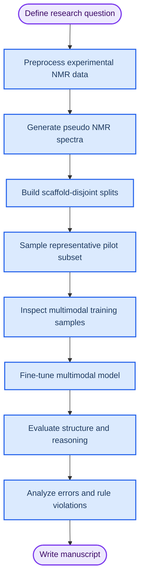

# SpectraLM 研究流程

_本文档说明本项目从研究问题定义、数据构建、模型微调、评价验证到论文写作的整体流程。_

---

## 研究目标

本研究旨在构建一个面向 `1H/13C NMR` 谱图解析的可解释多模态大模型系统。模型输入包括 combined NMR 谱图、峰表文本和 NMR 规则提示；模型输出包括谱学推理过程、`SELFIES` 和 canonical `SMILES`。

核心研究问题是：

> 在 scaffold-level 泛化设置下，微调后的多模态大模型能否结合 `1H/13C NMR` 谱图、峰表文本与 NMR 规则提示，生成可解释的谱学推理过程并准确预测有机分子结构？

## 整体流程



## 阶段一：研究问题与假设

主假设包括：

- `Image + Table + Rule Prompt` 在 `Exact Match` 和 `Tanimoto Similarity` 上优于 image-only、table-only 和 image+table 基线。
- 规则增强模型能生成更合理的谱学推理链，并减少明显 NMR 规则违反。
- `SELFIES` 可提升结构生成有效率，但最终评价应转换为 canonical `SMILES` 和 RDKit molecule 后进行。

成功标准不只看结构是否正确，也要看推理是否支持最终结构。结构正确但推理错误应视为部分成功，并标记为 shortcut learning 风险。

## 阶段二：数据构建

原始数据来自实验 NMR 数据集，包含 `SMILES`、`SELFIES`、`1H NMR` 峰表、`13C NMR` 峰表、溶剂、频率、多重峰、耦合常数和积分信息。

当前关键文件：

| 文件 | 作用 |
| --- | --- |
| `src/spectralm/data/preprocessing.py` | 合并同一分子的 `1H` 与 `13C` 数据，生成标准样本 |
| `src/spectralm/spectra/render.py` | 将离散峰表模拟为 combined NMR 谱图 |
| `src/spectralm/data/splitting.py` | 生成 scaffold split 和数据质量报告 |
| `src/spectralm/data/features.py` | 生成结构-only Morgan fingerprint |
| `src/spectralm/data/clustering.py` | 使用 Butina 对 Morgan fingerprint 聚类 |
| `src/spectralm/data/sampling.py` | 从分桶 Butina 聚类中选择代表性小样本 |
| `src/spectralm/training/dataset.py` | 构造多模态训练样本 |
| `src/spectralm/evaluation/metrics.py` | 评价结构预测、相似度、官能团一致性和 NMR 规则违反 |

## 阶段三：scaffold split 与代表性抽样

全量数据已完成 Bemis-Murcko scaffold split，确保 train、validation 和 test 的 scaffold 不重叠。该设置用于降低结构记忆和相似骨架泄漏风险。

首轮结构代表性微调使用：

```text
dataset/subsets/spectralm_butina_1000_300/
```

该子集包含：

| Split | 样本数 | 约束 |
| --- | ---: | --- |
| Train | 1000 | Morgan FP + Butina 代表样本；每个 scaffold 默认最多 1 条 |
| Test | 300 | 与 train scaffold 无重叠 |

Butina 子集构建原则：

- 只使用分子结构特征，不使用 `1H/13C` 峰表统计参与采样。
- Morgan fingerprint 默认使用 `radius=2`、`nBits=1024`。
- Butina 默认使用 Tanimoto similarity cutoff `0.7`。
- 优先覆盖更多 Butina cluster，同时限制 scaffold 重复。

## 阶段三补充：Morgan FP + Butina 聚类压缩

当原始实验 NMR 数据达到百万级，而微调预算只能支持约 `1000` 条训练样本时，推荐使用结构聚类压缩流程替代纯随机抽样。该流程只从分子结构中提取 Morgan fingerprint，再用 Butina 聚类压缩结构冗余样本，最后按 scaffold 约束选择代表样本。

默认流程为：

```bash
spectralm-fingerprint --config configs/fingerprint.yaml
spectralm-butina-sample --config configs/sample.yaml
```

聚类特征只包括：

- Morgan fingerprint
- canonical `SMILES`
- Murcko scaffold
- 官能团标签，仅用于报告和代表样本排序，不参与谱学特征建模

默认输出目录为：

```text
dataset/subsets/spectralm_butina_1000_300/
```

该流程替代旧的 `spectralm_500_100` 启发式采样流程，作为当前主实验推荐数据集。

## 阶段四：训练样本格式

每条训练样本包含一个多模态 user message 和一个 assistant target。

输入包括：

- combined `1H/13C` 谱图图像
- `1H NMR` 峰表文本
- `13C NMR` 峰表文本
- NMR 规则提示

输出格式为：

```text
Spectral reasoning:
- ...

Final SELFIES: ...
Final canonical SMILES: ...
```

这样设计的目的是把结构生成和谱学推理同时纳入训练目标。

## 阶段五：模型微调

首轮训练建议只使用 pilot 子集，目标是验证数据格式、训练流程和输出格式是否可行，而不是追求最高准确率。

推荐远程 GPU 服务器命令：

```bash
spectralm-train --config configs/train_pilot.yaml
```

当前本地不运行 GPU 训练。`src/spectralm/training/train.py` 已重构为只有执行 `main()` 时才加载 Unsloth 和模型。

## 阶段六：评价指标

评价分为结构准确性、谱学一致性和推理质量三类。

| 类别 | 指标 | 目的 |
| --- | --- | --- |
| 结构准确性 | Validity | 预测结构是否合法 |
| 结构准确性 | Exact Match | canonical `SMILES` 是否完全一致 |
| 结构相似性 | Tanimoto Similarity | 评估结构接近程度 |
| 化学一致性 | Formula Match | 分子式是否一致 |
| 谱学一致性 | NMR Rule Violation Rate | 是否违反积分、峰数、化学位移等基本规则 |
| 推理质量 | Reasoning-Structure Consistency | 推理链是否支持最终结构 |

推荐把结果分成四类：

| 结构输出 | 推理过程 | 判定 |
| --- | --- | --- |
| 正确 | 正确 | 完全成功 |
| 正确 | 错误或部分正确 | 部分成功，存在 shortcut 风险 |
| 相似但不完全正确 | 合理 | 部分成功 |
| 错误 | 错误 | 失败 |

## 阶段七：对照实验

论文主实验至少应包含以下对照：

| 组别 | 输入 | 是否微调 | 是否规则提示 |
| --- | --- | --- | --- |
| Zero-shot VLM | image + table | 否 | 否 |
| Fine-tuned image-only | image | 是 | 否 |
| Fine-tuned table-only | peak table | 是 | 否 |
| Fine-tuned image+table | image + peak table | 是 | 否 |
| SpectraLM | image + peak table + rule prompt | 是 | 是 |

首轮 pilot 可以先跑 `SpectraLM` 主方法，确认训练链路，再逐步补齐消融实验。

## 阶段八：错误分析

错误分析应重点检查：

- 结构正确但推理错误的 shortcut learning 案例
- `13C` 峰数与预测结构碳环境明显不一致的案例
- `1H` 积分总数与结构氢数不一致的案例
- 官能团判断错误导致的结构偏差
- scaffold split 下未见骨架的泛化失败案例

这些案例可作为论文 Discussion 和 Limitations 的核心材料。

## 当前状态

已完成：

- 研究问题收敛
- 全量 scaffold split
- 代表性 pilot 子集生成
- 多模态 dataset 构造
- 训练脚本重构
- 评价脚本与基础测试骨架

下一步：

1. 将项目同步到远程 GPU 服务器。
2. 使用 `configs/train_pilot.yaml` 跑通首轮 QLoRA 微调。
3. 抽样检查模型输出格式是否稳定。
4. 使用 `spectralm-evaluate --config configs/eval_pilot.yaml` 生成首轮评价报告。
5. 根据 pilot 结果调整 Butina cutoff、fingerprint bits 或 train/test 规模。
